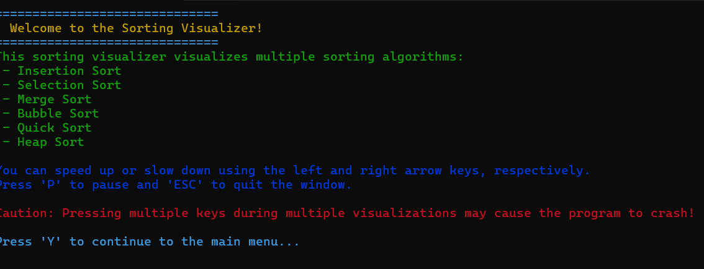
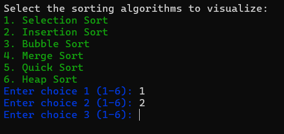
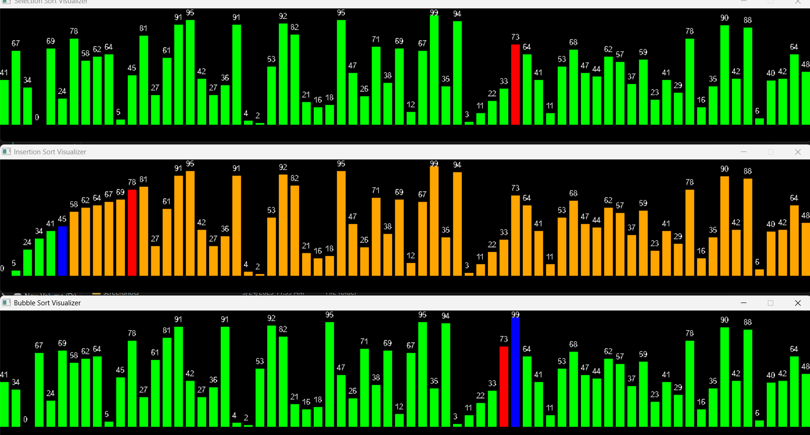

# Algorithm Visualizer

This is a sorting algorithm visualizer that visualizes the following algorithms:
- Insertion Sort
- Selection Sort
- Merge Sort
- Bubble Sort
- Quick Sort
- Heap Sort

## 🚀 Features
- Visualize sorting algorithms
- Adjust sorting speed (doesn't reflect real speed due to visualization)
- Multiple visualizations at once

## 📸 Screenshots

  
  


## 🛠️ Tech Stack
- C++
- SDL2

## Installation

1. **Clone the repository:**

   ```bash
   git clone https://github.com/your-username/project-name.git

2. **Adjust the make file**
Open the Makefile and update the include paths for SDL2 and SDL2_ttf to match your local setup.

3. **Build the project**
    Run the following command in the directory
    ```bash
    make
4. **Run the executable**
    !!!NOTE u need to have SDL2.dll , SDL2_ttf.dll and arial.ttf to run the .exe file
    ```bash
    .\sorting_visualizer.exe
or just run directly from folder by double clicking
    